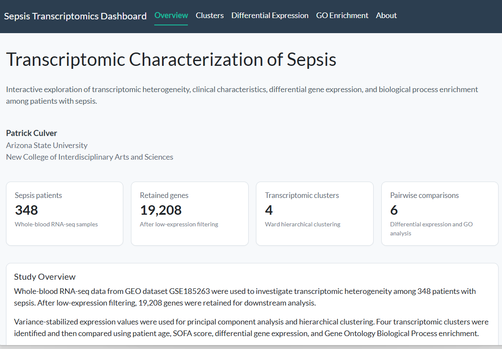
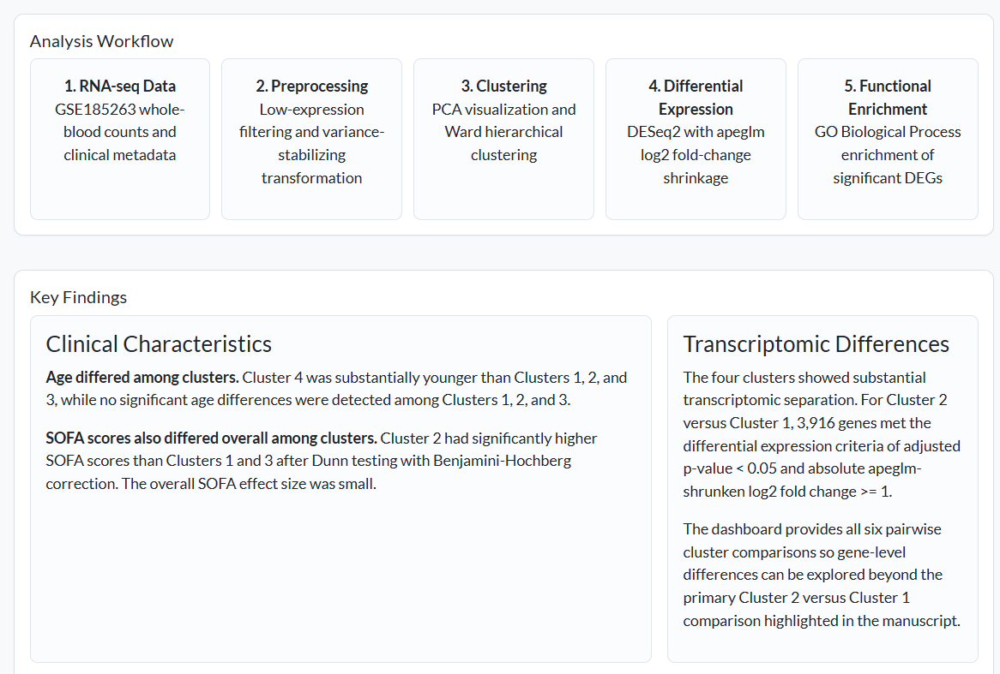

# Transcriptomic Characterization of Sepsis

**Patrick Culver**  
Arizona State University  
New College of Interdisciplinary Arts and Sciences

An interactive RNA-seq analysis of transcriptomic heterogeneity among patients with sepsis. This project combines unsupervised clustering, clinical comparisons, differential expression analysis, and Gene Ontology enrichment in an R Shiny dashboard.

> **Live dashboard:** deployment link will be added after the Shiny application is published.



## Project Overview

Whole-blood RNA-seq data from GEO dataset **GSE185263** were used to investigate transcriptomic heterogeneity among **348 patients with sepsis**. After low-expression filtering, **19,208 genes** were retained for downstream analysis. Variance-stabilized expression values were used for principal component analysis and hierarchical clustering, identifying **four transcriptomic clusters** for subsequent clinical and molecular comparison.

The interactive dashboard provides access to cluster characteristics, all six pairwise differential-expression comparisons, and Gene Ontology Biological Process enrichment results.

## Research Objective

The primary objective was to determine whether patients with sepsis could be separated into transcriptomically distinct subgroups and whether those groups differed in clinical characteristics and biological processes.

The analysis focused on three questions:

1. Do unsupervised gene-expression patterns identify distinct transcriptomic clusters among patients with sepsis?
2. Do patient age and SOFA score differ among the identified clusters?
3. Which genes and biological processes distinguish the transcriptomic clusters?

## Analysis Workflow

**RNA-seq counts → low-expression filtering → variance-stabilizing transformation → PCA and hierarchical clustering → clinical comparisons → differential expression → GO Biological Process enrichment**

- **RNA-seq data:** GSE185263 whole-blood count data and clinical metadata.
- **Preprocessing:** Genes with counts of at least 10 in at least five samples were retained; variance-stabilizing transformation was applied for exploratory and clustering analyses.
- **Clustering:** PCA used the 500 most variable VST-transformed genes. Hierarchical clustering used all 19,208 retained genes with Euclidean distance and Ward's `ward.D2` linkage, with the dendrogram cut at four clusters.
- **Clinical comparisons:** Age and SOFA score were evaluated with Kruskal-Wallis tests followed by Dunn tests with Benjamini-Hochberg correction when appropriate.
- **Differential expression:** DESeq2 was used for all six pairwise cluster comparisons, with apeglm log2 fold-change shrinkage. Significant DEGs were defined by adjusted *p* < 0.05 and absolute shrunken log2 fold change ≥ 1.
- **Functional enrichment:** GO Biological Process enrichment was performed separately for upregulated and downregulated genes using clusterProfiler.

## Key Findings



### Clinical heterogeneity

Age differed significantly among clusters, with **Cluster 4 substantially younger than Clusters 1, 2, and 3**. SOFA scores also differed overall among clusters. **Cluster 2 had significantly higher SOFA scores than Clusters 1 and 3** after Dunn testing with Benjamini-Hochberg correction, although the overall SOFA effect size was small.

### Transcriptomic differences

Substantial differential expression was observed across the four clusters. In the primary **Cluster 2 versus Cluster 1** comparison, **3,916 genes** met the differential-expression criteria. The dashboard allows exploration of all six pairwise cluster comparisons through interactive volcano plots and searchable gene-level tables.

### Biological interpretation

Genes with higher expression in Cluster 2 relative to Cluster 1 were enriched for inflammatory and innate immune processes, including regulation of inflammatory response, chemotaxis, and defense response to bacterium. Genes with lower expression were enriched for adaptive immune processes, including antigen receptor signaling, lymphocyte activation, and T-cell differentiation. Rather than indicating a uniform increase in immune activity, this pattern suggests an imbalance between innate inflammatory activity and adaptive immune function.

This molecular pattern was accompanied by significantly higher SOFA scores in Cluster 2 than in Clusters 1 and 3, although the overall SOFA effect size was small. Cluster 4 was substantially younger than the other clusters, indicating that age may contribute to some of its transcriptomic separation.

Overall, the findings support biologically meaningful heterogeneity among patients with sepsis. The four groups are therefore interpreted as **transcriptomic clusters rather than established clinical endotypes**, and external validation would be required before assigning diagnostic or prognostic significance.

## Interactive Dashboard

The R Shiny dashboard contains four analytical views plus project documentation:

- **Overview** — study design, workflow, summary statistics, and major findings.
- **Clusters** — interactive PCA visualization, cluster sizes, and age/SOFA comparisons.
- **Differential Expression** — interactive volcano plots, DEG counts, top genes, and searchable result tables for all six pairwise comparisons.
- **GO Enrichment** — interactive Biological Process enrichment plots and searchable GO-term tables for upregulated and downregulated genes.
- **About** — methods, data/software information, project scope, and references.

## Repository Structure

```text
sepsis-transcriptomics/
├── app/
│   └── app.R
├── figures/
│   └── ...
├── results/
│   ├── figures/
│   │   ├── expression_heatmap/
│   │   └── go_enrichment/
│   └── tables/
│       ├── differential_expression/
│       ├── expression_heatmap/
│       ├── go_enrichment/
│       └── ...
├── scripts/
│   ├── 00_setup.R
│   ├── 01_preprocessing.R
│   ├── 02_exploratory_analysis.R
│   ├── 02_load_dds.R
│   ├── 03_pca_clustering.R
│   ├── 04_cluster_statistics.R
│   ├── 05_differential_expression.R
│   ├── 06_go_enrichment.R
│   ├── 07_go_figures.R
│   ├── 08_expression_heatmap.R
│   └── citations.R
├── .gitignore
├── README.md
└── Sepsis_RNAseq_project.Rproj
```

Raw data and large intermediate R objects are intentionally excluded from the repository.

## Running the Dashboard Locally

The dashboard reads finalized analysis outputs from `results/tables/`; it does not rerun the complete RNA-seq analysis when launched.

From the project root in R:

```r
shiny::runApp("app")
```

The principal dashboard packages are:

```r
install.packages(c("shiny", "bslib", "plotly", "DT", "ggplot2", "dplyr"))
```

## Reproducing the Analysis

Analysis scripts are organized in approximate workflow order in the `scripts/` directory. The complete analysis additionally uses Bioconductor packages including DESeq2, apeglm, clusterProfiler, and annotation resources.

Because raw sequencing/count data and large intermediate R objects are not stored in this repository, obtain the source dataset from **GEO accession GSE185263** before reproducing the complete workflow.

## Data Availability

The analysis uses publicly available whole-blood RNA-seq data from **NCBI Gene Expression Omnibus accession GSE185263**. Raw/source data are not redistributed in this repository.

## Software

The analysis and dashboard were developed in **R**. Major packages include:

- DESeq2
- apeglm
- clusterProfiler
- ggplot2
- plotly
- Shiny
- bslib
- DT
- dplyr

## References

1. Baghela AS, et al. *Predicting sepsis severity at first clinical presentation: the role of endotypes and mechanistic signatures.* Dataset deposited as GEO accession GSE185263.
2. Love MI, Huber W, Anders S. Moderated estimation of fold change and dispersion for RNA-seq data with DESeq2. *Genome Biology.* 2014;15:550.
3. Zhu A, Ibrahim JG, Love MI. Heavy-tailed prior distributions for sequence count data: removing the noise and preserving large differences. *Bioinformatics.* 2019;35:2084–2092.
4. Yu G, Wang LG, Han Y, He QY. clusterProfiler: an R package for comparing biological themes among gene clusters. *OMICS.* 2012;16(5):284–287.
5. Chenoweth JG, et al. Sepsis endotypes identified by host gene expression across global cohorts. *Communications Medicine.* 2024;4:120.
6. Yang JO, et al. Whole blood transcriptomics identifies subclasses of pediatric septic shock. *Critical Care.* 2023;27:486.

## Project Scope

This project is an exploratory transcriptomic analysis intended to characterize molecular heterogeneity within sepsis. The identified clusters should not be interpreted as clinically validated diagnostic or prognostic classifications. Cohort was not included as a covariate in the clustering or differential-expression models, so some observed transcriptomic variation may reflect cohort-associated effects.
